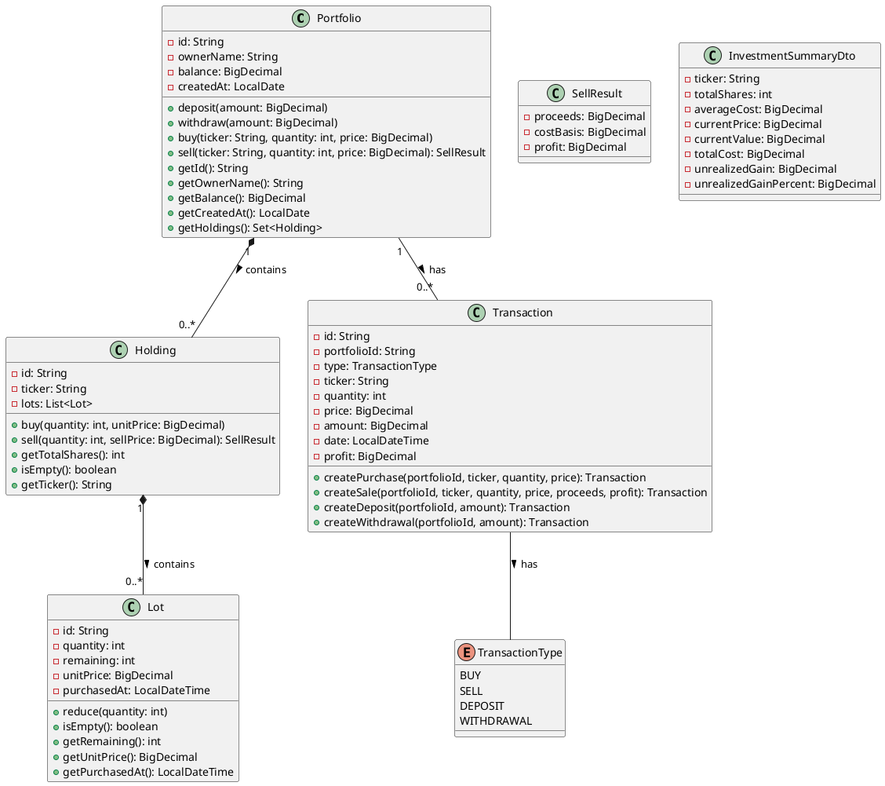

# Stock Portfolio API Specification

## 1. USER STORIES

### 1.1 Buy Stocks User Story
**As an** investor with a portfolio  
**I want to** purchase shares of a specific stock by simply providing the ticker symbol and quantity  
**So that** I can build my investment portfolio without needing to manually research current market prices

**Acceptance Criteria:**
- I must have sufficient funds in my portfolio balance to cover the total purchase amount
- I only need to specify the stock ticker symbol and the desired quantity of shares
- The system will automatically fetch the current market price for the specified stock
- The system validates that both the quantity is positive and the fetched price is valid
- If validation fails or I have insufficient funds, the operation is rejected with a clear error message
- Upon success, the system:
  - Creates a new "lot" recording the purchase details (quantity, price, date)
  - Adds this lot to my existing holding of this stock (or creates a new holding if this is my first purchase)
  - Deducts the total cost from my portfolio's cash balance
  - Records a PURCHASE transaction in my transaction history
  - Returns a confirmation of the successful purchase

### 1.2 Sell Stocks User Story
**As an** investor with existing stock holdings  
**I want to** sell shares of a specific stock by simply providing the ticker symbol and quantity  
**So that** I can realize profits, cut losses, or rebalance my portfolio based on current market conditions

**Acceptance Criteria:**
- I must have sufficient shares of the specified stock in my holdings
- I only need to specify the stock ticker symbol and the quantity I wish to sell
- The system will automatically fetch the current market price for the specified stock
- The system validates that both the quantity is positive and the fetched price is valid
- If validation fails or I have insufficient shares, the operation is rejected with a clear error message
- Upon success, the system:
  - Sells shares using FIFO (First-In-First-Out) accounting method (oldest shares are sold first)
  - Calculates the cost basis of the sold shares based on their original purchase prices
  - Calculates the proceeds (quantity × current price) and profit/loss (proceeds - cost basis)
  - Increases my portfolio's cash balance by the proceeds amount
  - Records a SALE transaction in my transaction history, including the profit/loss information
  - Removes the sold shares from my holdings (and removes the holding entirely if all shares are sold)
  - Returns detailed results including proceeds, cost basis, and profit/loss

### 1.3 Deposit Funds User Story
**As an** investor managing my portfolio  
**I want to** add money to my portfolio's cash balance  
**So that** I have funds available for future stock purchases

**Acceptance Criteria:**
- I must specify a positive amount to deposit
- Upon success, the system:
  - Increases my portfolio's cash balance by the deposited amount
  - Records a DEPOSIT transaction in my transaction history
  - Returns a confirmation of the successful deposit

### 1.4 Withdraw Funds User Story
**As an** investor managing my portfolio  
**I want to** withdraw money from my portfolio's cash balance  
**So that** I can use these funds elsewhere or realize investment gains

**Acceptance Criteria:**
- I must specify a positive amount to withdraw
- I must have sufficient funds in my portfolio's cash balance
- If I have insufficient funds, the withdrawal is rejected with a clear error message
- Upon success, the system:
  - Decreases my portfolio's cash balance by the withdrawn amount
  - Records a WITHDRAWAL transaction in my transaction history
  - Returns a confirmation of the successful withdrawal

### 1.5 View Portfolio Performance User Story
**As an** investor monitoring my investments  
**I want to** see a summary of my portfolio's performance  
**So that** I can assess how my investments are doing and make informed decisions

**Acceptance Criteria:**
- The system provides a comprehensive performance summary for each stock in my portfolio
- For each stock, the summary includes:
  - Current market price (automatically fetched)
  - Total shares owned
  - Average purchase price
  - Total cost basis
  - Current market value
  - Unrealized gain/loss (both absolute and percentage)
- I can optionally limit the number of stocks shown in the results
- The results are sorted with best-performing stocks first

## 2. REST ENDPOINTS

### 2.1 Buy Stocks Endpoint

#### OpenAPI 3 Specification
```yaml
paths:
  /api/portfolios/{id}/purchases:
    post:
      summary: Buy shares of a stock for a specific portfolio
      description: Purchases a specified quantity of a stock at the current market price
      tags:
        - Portfolio Operations
      parameters:
        - name: id
          in: path
          required: true
          description: Unique identifier of the portfolio
          schema:
            type: string
            format: uuid
      requestBody:
        required: true
        content:
          application/json:
            schema:
              type: object
              required:
                - ticker
                - quantity
              properties:
                ticker:
                  type: string
                  description: The stock symbol/ticker (e.g., AAPL, MSFT)
                  example: "AAPL"
                quantity:
                  type: integer
                  description: Number of shares to purchase
                  minimum: 1
                  example: 10
      responses:
        '200':
          description: Stock purchase successful
          content:
            application/json:
              schema:
                type: object
                properties: {}
        '400':
          description: Invalid request
          content:
            application/json:
              schema:
                type: object
                properties:
                  error:
                    type: string
                    example: "Invalid quantity"
                  details:
                    type: string
        '404':
          description: Portfolio not found
          content:
            application/json:
              schema:
                type: object
                properties:
                  error:
                    type: string
                    example: "Portfolio not found with id: 123e4567-e89b-12d3-a456-426614174000"
        '409':
          description: Insufficient funds
          content:
            application/json:
              schema:
                type: object
                properties:
                  error:
                    type: string
                    example: "Insufficient funds for withdrawal"
```

**Explanation:**
This endpoint allows an investor to purchase shares of a stock by specifying just the ticker symbol and quantity. The system automatically fetches the current market price, verifies that the portfolio has sufficient funds, executes the purchase, creates a new lot in the appropriate holding, and updates the portfolio's cash balance. The portfolio ID is specified in the path, while the ticker and quantity are passed in the request body. The endpoint returns a 200 OK response on success with no specific content, or appropriate error responses when the operation fails.

### 2.2 Sell Stocks Endpoint

#### OpenAPI 3 Specification
```yaml
paths:
  /api/portfolios/{id}/sales:
    post:
      summary: Sell shares of a stock from a specific portfolio
      description: Sells a specified quantity of a stock at the current market price using FIFO accounting method
      tags:
        - Portfolio Operations
      parameters:
        - name: id
          in: path
          required: true
          description: Unique identifier of the portfolio
          schema:
            type: string
            format: uuid
      requestBody:
        required: true
        content:
          application/json:
            schema:
              type: object
              required:
                - ticker
                - quantity
              properties:
                ticker:
                  type: string
                  description: The stock symbol/ticker (e.g., AAPL, MSFT)
                  example: "AAPL"
                quantity:
                  type: integer
                  description: Number of shares to sell
                  minimum: 1
                  example: 5
      responses:
        '200':
          description: Stock sale successful
          content:
            application/json:
              schema:
                type: object
                properties:
                  proceeds:
                    type: number
                    format: decimal
                    description: Total amount received from the sale
                    example: 901.25
                  costBasis:
                    type: number
                    format: decimal
                    description: Original cost of the sold shares
                    example: 877.50
                  profit:
                    type: number
                    format: decimal
                    description: Profit or loss from the sale (proceeds - costBasis)
                    example: 23.75
        '400':
          description: Invalid request
          content:
            application/json:
              schema:
                type: object
                properties:
                  error:
                    type: string
                    example: "Invalid quantity"
                  details:
                    type: string
        '404':
          description: Portfolio or holding not found
          content:
            application/json:
              schema:
                type: object
                properties:
                  error:
                    type: string
                    example: "No holding found for ticker: AAPL"
        '409':
          description: Insufficient shares
          content:
            application/json:
              schema:
                type: object
                properties:
                  error:
                    type: string
                    example: "Not enough shares of AAPL to sell"
```

**Explanation:**
This endpoint enables an investor to sell shares from their portfolio by providing only the ticker and quantity. The system automatically fetches the current market price, verifies the investor has sufficient shares, sells the shares using FIFO accounting, and returns detailed information about the sale. The response includes the total proceeds from the sale, the original cost basis of the shares sold, and the profit or loss realized from the transaction. The portfolio ID is specified in the path, while the ticker and quantity are passed in the request body.

### 2.3 Additional Implemented Endpoints

The system also implements several other important portfolio operations:

#### Create Portfolio
```yaml
paths:
  /api/portfolios:
    post:
      summary: Create a new portfolio
      description: Creates a new investment portfolio for a user
      requestBody:
        required: true
        content:
          application/json:
            schema:
              type: object
              required:
                - ownerName
              properties:
                ownerName:
                  type: string
      responses:
        '201':
          description: Portfolio created successfully
          content:
            application/json:
              schema:
                $ref: '#/components/schemas/Portfolio'
```

#### Get Portfolio
```yaml
paths:
  /api/portfolios/{id}:
    get:
      summary: Get portfolio details
      description: Retrieves a portfolio by its ID
      parameters:
        - name: id
          in: path
          required: true
          schema:
            type: string
      responses:
        '200':
          description: Portfolio found
          content:
            application/json:
              schema:
                $ref: '#/components/schemas/Portfolio'
        '404':
          description: Portfolio not found
```

#### Deposit Funds
```yaml
paths:
  /api/portfolios/{id}/deposits:
    post:
      summary: Deposit funds into a portfolio
      description: Adds funds to a portfolio's cash balance
      parameters:
        - name: id
          in: path
          required: true
          schema:
            type: string
      requestBody:
        required: true
        content:
          application/json:
            schema:
              type: object
              required:
                - amount
              properties:
                amount:
                  type: number
                  format: decimal
      responses:
        '200':
          description: Deposit successful
```

#### Withdraw Funds
```yaml
paths:
  /api/portfolios/{id}/withdrawals:
    post:
      summary: Withdraw funds from a portfolio
      description: Removes funds from a portfolio's cash balance
      parameters:
        - name: id
          in: path
          required: true
          schema:
            type: string
      requestBody:
        required: true
        content:
          application/json:
            schema:
              type: object
              required:
                - amount
              properties:
                amount:
                  type: number
                  format: decimal
      responses:
        '200':
          description: Withdrawal successful
        '409':
          description: Insufficient funds
```

#### Get Transaction History
```yaml
paths:
  /api/portfolios/{id}/transactions:
    get:
      summary: Get transaction history
      description: Retrieves the transaction history for a portfolio with optional filters
      parameters:
        - name: id
          in: path
          required: true
          schema:
            type: string
        - name: ticker
          in: query
          required: false
          schema:
            type: string
        - name: type
          in: query
          required: false
          schema:
            type: string
        - name: fromDate
          in: query
          required: false
          schema:
            type: string
            format: date
        - name: toDate
          in: query
          required: false
          schema:
            type: string
            format: date
        - name: minAmount
          in: query
          required: false
          schema:
            type: number
        - name: maxAmount
          in: query
          required: false
          schema:
            type: number
      responses:
        '200':
          description: List of transactions
          content:
            application/json:
              schema:
                type: array
                items:
                  $ref: '#/components/schemas/Transaction'
```

#### Get Portfolio Performance
```yaml
paths:
  /api/portfolios/{id}/performance:
    get:
      summary: Get portfolio performance summary
      description: Retrieves performance metrics for a portfolio
      parameters:
        - name: id
          in: path
          required: true
          schema:
            type: string
        - name: limit
          in: query
          required: false
          schema:
            type: integer
      responses:
        '200':
          description: Performance summary
          content:
            application/json:
              schema:
                type: array
                items:
                  $ref: '#/components/schemas/InvestmentSummary'
```

## 3. DOMAIN MODEL

### 3.1 Domain Entities

#### Portfolio
- **Description**: Represents an investor's investment account containing cash and stock holdings
- **Attributes**:
  - `id`: Unique identifier
  - `ownerName`: Name of the portfolio owner
  - `balance`: Cash balance available for investments
  - `createdAt`: Date when the portfolio was created
  - `holdings`: Collection of stock holdings in this portfolio
- **Responsibilities**:
  - Managing cash through deposits and withdrawals
  - Facilitating stock purchases and sales
  - Tracking all holdings
  - Enforcing business rules (e.g., preventing purchases with insufficient funds)

#### Holding
- **Description**: Represents ownership of a specific stock within a portfolio
- **Attributes**:
  - `id`: Unique identifier
  - `ticker`: Stock symbol (e.g., AAPL, MSFT)
  - `lots`: Chronologically ordered collection of purchase lots
- **Responsibilities**:
  - Tracking all purchase lots for a specific stock
  - Managing the selling process using FIFO accounting
  - Calculating total shares owned of the stock

#### Lot
- **Description**: Represents a specific purchase of shares at a certain price and time
- **Attributes**:
  - `id`: Unique identifier
  - `quantity`: Original number of shares purchased
  - `remaining`: Current number of shares remaining in this lot
  - `unitPrice`: Price per share paid
  - `purchasedAt`: Date and time of purchase
- **Responsibilities**:
  - Tracking the original purchase details
  - Managing the reduction of shares when sales occur

#### Transaction
- **Description**: Records financial activities within a portfolio
- **Attributes**:
  - `id`: Unique identifier
  - `portfolioId`: Portfolio this transaction belongs to
  - `type`: Type of transaction (BUY, SELL, DEPOSIT, WITHDRAWAL)
  - `ticker`: Stock symbol (for BUY/SELL transactions)
  - `quantity`: Number of shares (for BUY/SELL transactions)
  - `price`: Price per share (for BUY/SELL transactions)
  - `amount`: Total transaction amount
  - `date`: Date and time of the transaction
  - `profit`: Profit or loss for SELL transactions
- **Responsibilities**:
  - Providing a historical record of all financial activities
  - Supporting transaction history and reporting

### 3.2 Relationships
- A **Portfolio** contains multiple **Holdings** (one-to-many)
- A **Holding** contains multiple **Lots** (one-to-many)
- A **Portfolio** is associated with multiple **Transactions** (one-to-many)

## 4. PLANTUML DIAGRAM



## 5. HTTP REQUEST FILE

```http
### Create a new portfolio
POST http://localhost:8080/api/portfolios
Content-Type: application/json

{
  "ownerName": "John Doe"
}

### Deposit funds into a portfolio
POST http://localhost:8080/api/portfolios/550e8400-e29b-41d4-a716-446655440000/deposits
Content-Type: application/json

{
  "amount": 10000.00
}

### Buy Stocks Request
POST http://localhost:8080/api/portfolios/550e8400-e29b-41d4-a716-446655440000/purchases
Content-Type: application/json

{
  "ticker": "AAPL",
  "quantity": 10
}

### Sell Stocks Request
POST http://localhost:8080/api/portfolios/550e8400-e29b-41d4-a716-446655440000/sales
Content-Type: application/json

{
  "ticker": "AAPL",
  "quantity": 5
}

### Get portfolio details
GET http://localhost:8080/api/portfolios/550e8400-e29b-41d4-a716-446655440000

### Get transaction history
GET http://localhost:8080/api/portfolios/550e8400-e29b-41d4-a716-446655440000/transactions

### Get filtered transactions (example: only AAPL buys)
GET http://localhost:8080/api/portfolios/550e8400-e29b-41d4-a716-446655440000/transactions?ticker=AAPL&type=BUY

### Get portfolio performance
GET http://localhost:8080/api/portfolios/550e8400-e29b-41d4-a716-446655440000/performance
```

## 6. SUGGESTED FUTURE EVOLUTIONS

### 6.1 Portfolio Performance Analysis
Implement additional metrics and endpoints to enhance the existing performance analysis:
- Day-to-day change in portfolio value
- Sector-based diversification analysis
- Performance comparison with market benchmarks
- Risk metrics (beta, volatility)
- Portfolio allocation visualization

### 6.2 Tax Reporting
Develop functionality to generate tax reports for investment activity:
- Annual realized gains/losses report
- Long-term vs. short-term capital gains classification
- Tax lot optimization strategies (beyond simple FIFO)
- Export capabilities for tax preparation software

## 7. IMPLEMENTATION NOTES AND DEVIATIONS

### 7.1 Automated Stock Price Fetching
The current implementation automatically fetches stock prices at the time of transaction, rather than requiring clients to provide prices. This approach has several implications:

- **Advantages**:
  - Simplifies the client API by requiring fewer parameters
  - Ensures all transactions use legitimate market prices
  - Prevents price manipulation by clients

- **Disadvantages**:
  - Creates a dependency on the stock price service
  - Makes historical testing more difficult
  - May cause issues if the price service is unavailable

### 7.2 REST Design Considerations

The current API follows a resource-oriented design with some notable characteristics:

- **Collection Resources**:
  - Uses noun-based endpoints for collections (`/purchases`, `/sales`, `/deposits`, `/withdrawals`)
  - Each collection is properly nested under its parent portfolio resource

- **HTTP Status Codes**:
  - Returns 200 OK for successful operations rather than 201 Created for new resources
  - Uses appropriate error codes (404, 409) for different failure conditions

- **Potential Improvements**:
  - Consider using PUT for idempotent operations
  - Return 201 Created with a location header for resource creation operations
  - Include more detailed responses for successful operations

### 7.3 Transaction Recording

The system maintains a comprehensive transaction history for all financial operations:

- Each deposit, withdrawal, purchase, and sale is recorded as a Transaction
- Transactions are immutable records of the financial history
- The transaction history can be filtered and queried through the API

This approach provides full auditability and supports detailed reporting, but requires careful database design to handle potentially large transaction volumes efficiently.