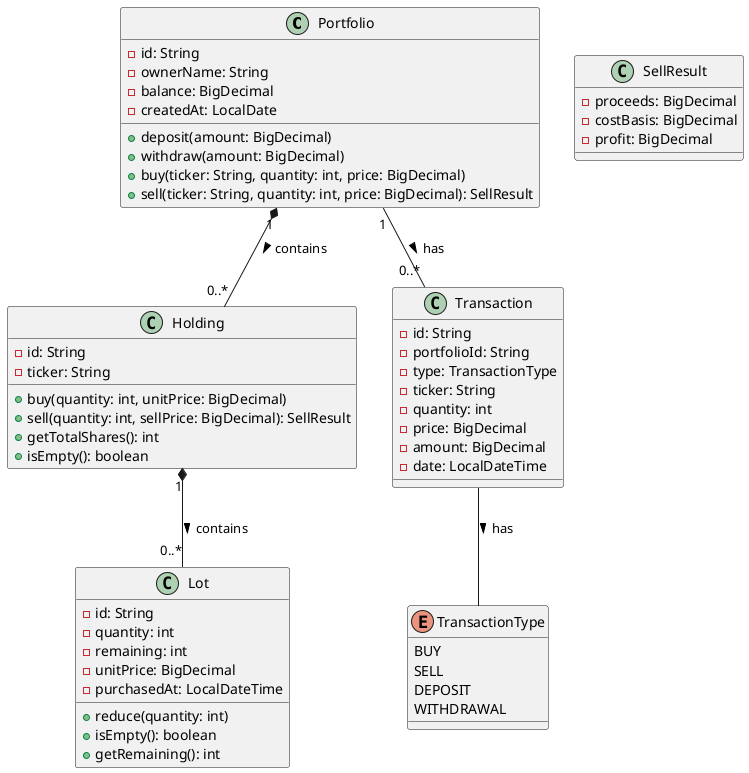

# Stock Portfolio API Specification

## 1. USER STORIES

### 1.1 Buy Stocks User Story
**As an** investor with a portfolio  
**I want to** purchase shares of a specific stock  
**So that** I can build my investment portfolio and potentially profit from price appreciation and dividends

**Acceptance Criteria:**
- I must have sufficient funds in my portfolio balance
- I must specify the stock ticker, quantity, and purchase price
- The system must record the purchase as a lot with date and time
- My portfolio balance must decrease by the total purchase amount
- My holding of the specified stock must increase by the purchased quantity

### 1.2 Sell Stocks User Story
**As an** investor with stock holdings  
**I want to** sell shares of a specific stock  
**So that** I can realize profits, cut losses, or rebalance my portfolio

**Acceptance Criteria:**
- I must have sufficient shares of the specified stock to sell
- I must specify the stock ticker, quantity, and selling price
- The system must sell shares using FIFO (First-In-First-Out) accounting
- My portfolio balance must increase by the total sale proceeds
- My holdings of the specified stock must decrease by the sold quantity
- The system must calculate and return the profit/loss from the sale

## 2. REST ENDPOINTS

### 2.1 Buy Stocks Endpoint

#### OpenAPI 3 Specification
```yaml
paths:
  /api/portfolios/{portfolioId}/buy:
    post:
      summary: Buy shares of a stock for a specific portfolio
      description: Purchases a specified quantity of a stock and adds it to the portfolio
      tags:
        - Portfolio Operations
      parameters:
        - name: portfolioId
          in: path
          required: true
          description: Unique identifier of the portfolio
          schema:
            type: string
            format: uuid
      requestBody:
        required: true
        content:
          application/json:
            schema:
              type: object
              required:
                - ticker
                - quantity
                - price
              properties:
                ticker:
                  type: string
                  description: The stock symbol/ticker (e.g., AAPL, MSFT)
                  example: "AAPL"
                quantity:
                  type: integer
                  description: Number of shares to purchase
                  minimum: 1
                  example: 10
                price:
                  type: number
                  format: decimal
                  description: Price per share
                  minimum: 0.01
                  example: 175.50
      responses:
        '201':
          description: Stock purchase successful
          content:
            application/json:
              schema:
                type: object
                properties:
                  portfolioId:
                    type: string
                  ticker:
                    type: string
                  quantity:
                    type: integer
                  price:
                    type: number
                  totalCost:
                    type: number
                  transactionDate:
                    type: string
                    format: date-time
                  remainingBalance:
                    type: number
        '400':
          description: Invalid request
          content:
            application/json:
              schema:
                type: object
                properties:
                  error:
                    type: string
                    example: "Invalid quantity or price"
                  details:
                    type: string
        '404':
          description: Portfolio not found
          content:
            application/json:
              schema:
                type: object
                properties:
                  error:
                    type: string
                    example: "Portfolio not found"
        '409':
          description: Insufficient funds
          content:
            application/json:
              schema:
                type: object
                properties:
                  error:
                    type: string
                    example: "Insufficient funds to complete this purchase"
                  currentBalance:
                    type: number
                  requiredAmount:
                    type: number
```

**Explanation:**
This endpoint allows an investor to purchase shares of a stock. The investor must provide the portfolio ID, stock ticker, quantity of shares, and the price per share. The system validates the request, ensures the portfolio has sufficient funds, creates a new lot in the appropriate holding, and updates the portfolio's cash balance. It returns details of the successful transaction or appropriate error messages.

### 2.2 Sell Stocks Endpoint

#### OpenAPI 3 Specification
```yaml
paths:
  /api/portfolios/{portfolioId}/sell:
    post:
      summary: Sell shares of a stock from a specific portfolio
      description: Sells a specified quantity of a stock using FIFO accounting method
      tags:
        - Portfolio Operations
      parameters:
        - name: portfolioId
          in: path
          required: true
          description: Unique identifier of the portfolio
          schema:
            type: string
            format: uuid
      requestBody:
        required: true
        content:
          application/json:
            schema:
              type: object
              required:
                - ticker
                - quantity
                - price
              properties:
                ticker:
                  type: string
                  description: The stock symbol/ticker (e.g., AAPL, MSFT)
                  example: "AAPL"
                quantity:
                  type: integer
                  description: Number of shares to sell
                  minimum: 1
                  example: 5
                price:
                  type: number
                  format: decimal
                  description: Price per share
                  minimum: 0.01
                  example: 180.25
      responses:
        '200':
          description: Stock sale successful
          content:
            application/json:
              schema:
                type: object
                properties:
                  portfolioId:
                    type: string
                  ticker:
                    type: string
                  quantity:
                    type: integer
                  price:
                    type: number
                  proceeds:
                    type: number
                  costBasis:
                    type: number
                  profit:
                    type: number
                  transactionDate:
                    type: string
                    format: date-time
                  newBalance:
                    type: number
                  remainingShares:
                    type: integer
        '400':
          description: Invalid request
          content:
            application/json:
              schema:
                type: object
                properties:
                  error:
                    type: string
                    example: "Invalid quantity or price"
                  details:
                    type: string
        '404':
          description: Portfolio or holding not found
          content:
            application/json:
              schema:
                type: object
                properties:
                  error:
                    type: string
                    example: "No holding found for ticker: AAPL"
        '409':
          description: Insufficient shares
          content:
            application/json:
              schema:
                type: object
                properties:
                  error:
                    type: string
                    example: "Not enough shares to sell"
                  availableShares:
                    type: integer
                  requestedShares:
                    type: integer
```

**Explanation:**
This endpoint enables an investor to sell shares from their portfolio. The investor provides the portfolio ID, stock ticker, quantity to sell, and the selling price. The system uses the FIFO method to determine which lots to sell from, calculates proceeds and profit/loss, updates the portfolio's cash balance and holdings, and returns detailed transaction results including the profit or loss on the sale.

## 3. DOMAIN MODEL

### 3.1 Domain Entities

#### Portfolio
- **Description**: Represents an investor's investment account containing cash and stock holdings
- **Attributes**:
  - `id`: Unique identifier
  - `ownerName`: Name of the portfolio owner
  - `balance`: Cash balance available for investments
  - `createdAt`: Date when the portfolio was created
  - `holdings`: Collection of stock holdings in this portfolio
- **Responsibilities**:
  - Managing cash through deposits and withdrawals
  - Facilitating stock purchases and sales
  - Tracking all holdings
  - Enforcing business rules (e.g., preventing purchases with insufficient funds)

#### Holding
- **Description**: Represents ownership of a specific stock within a portfolio
- **Attributes**:
  - `id`: Unique identifier
  - `ticker`: Stock symbol (e.g., AAPL, MSFT)
  - `lots`: Chronologically ordered collection of purchase lots
- **Responsibilities**:
  - Tracking all purchase lots for a specific stock
  - Managing the selling process using FIFO accounting
  - Calculating total shares owned of the stock

#### Lot
- **Description**: Represents a specific purchase of shares at a certain price and time
- **Attributes**:
  - `id`: Unique identifier
  - `quantity`: Original number of shares purchased
  - `remaining`: Current number of shares remaining in this lot
  - `unitPrice`: Price per share paid
  - `purchasedAt`: Date and time of purchase
- **Responsibilities**:
  - Tracking the original purchase details
  - Managing the reduction of shares when sales occur

#### Transaction
- **Description**: Records financial activities within a portfolio
- **Attributes**:
  - `id`: Unique identifier
  - `portfolioId`: Portfolio this transaction belongs to
  - `type`: Type of transaction (BUY, SELL, DEPOSIT, WITHDRAWAL)
  - `ticker`: Stock symbol (for BUY/SELL transactions)
  - `quantity`: Number of shares (for BUY/SELL transactions)
  - `price`: Price per share (for BUY/SELL transactions)
  - `amount`: Total transaction amount
  - `date`: Date and time of the transaction
- **Responsibilities**:
  - Providing a historical record of all financial activities
  - Supporting transaction history and reporting

### 3.2 Relationships
- A **Portfolio** contains multiple **Holdings** (one-to-many)
- A **Holding** contains multiple **Lots** (one-to-many)
- A **Portfolio** is associated with multiple **Transactions** (one-to-many)

## 4. PLANTUML DIAGRAM



## 5. HTTP REQUEST FILE

```http
### Buy Stocks Request
POST http://localhost:8080/api/portfolios/550e8400-e29b-41d4-a716-446655440000/buy
Content-Type: application/json

{
  "ticker": "AAPL",
  "quantity": 10,
  "price": 175.50
}

### Sell Stocks Request
POST http://localhost:8080/api/portfolios/550e8400-e29b-41d4-a716-446655440000/sell
Content-Type: application/json

{
  "ticker": "AAPL",
  "quantity": 5,
  "price": 180.25
}
```

## 6. SUGGESTED FUTURE EVOLUTIONS

### 6.1 Portfolio Performance Analysis
Implement endpoints to calculate and report portfolio performance metrics, including:
- Total portfolio value over time
- Individual stock performance within the portfolio
- Realized and unrealized gains/losses
- Portfolio diversification analysis
- Comparative performance against market benchmarks (e.g., S&P 500)

### 6.2 Tax Reporting
Develop functionality to generate tax reports for investment activity:
- Annual realized gains/losses report
- Long-term vs. short-term capital gains classification
- Tax lot optimization strategies (beyond simple FIFO)
- Export capabilities for tax preparation software

This would significantly enhance the utility of the application for investors who need to manage their tax liabilities efficiently.